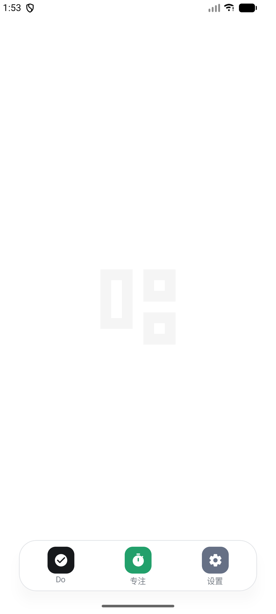

# DayDayUp

一款为 Android 手机与平板设计的极简待办与专注应用。

把今天要做的事、以后要做的事和真正投入的时间放在同一个地方。没有复杂层级，没有多余入口，打开就能开始。

> 当前版本 `1.1` · 支持 Android 8.0 及以上系统

## 界面预览

<p align="center">
  
  
  
</p>

<p align="center">
  
  
  
</p>

## 功能

### Today：只看今天

- 集中展示今天仍需完成的任务
- 任务完成后即时更新今日进度与百分比
- 已完成任务保留在当天列表中，状态一目了然
- 过期的 Plan 任务自动进入 Today，不会被遗忘
- 空状态保持干净，不使用多余提示打扰

### Plan：把以后留给以后

- 将暂时不需要处理的事项放入 Plan
- 可为计划任务选择具体日期
- 到达计划日期后自动归入 Today
- Today 与 Plan 可以在编辑任务时随时切换
- 计划日期、提醒时间和备注直接显示在任务摘要中

### 完整的任务操作

- 快速创建任务
- 添加可选备注
- 编辑任务内容与所属列表
- 一键标记完成或恢复未完成
- 设置通知提醒
- 删除的任务先进入回收站，避免误操作
- 回收站内容支持恢复、永久删除和自动清理

### 专注计时

- 支持正计时，适合开放式学习或工作
- 支持倒计时，适合番茄钟和固定时长任务
- 专注时可填写学习内容，也可以直接开始
- 可以把一次专注关联到已有任务
- 计时过程中支持暂停、继续、完成和取消
- 倒计时结束后通过系统提醒通知
- 不足一分钟的短暂误触不会写入正式记录

### 专注记录

- 汇总当天累计专注时长
- 显示当天完成的专注次数
- 按学习内容统计时间分布
- 保留最近的专注记录
- 可进入全部记录查看历史内容
- 支持删除不需要的专注记录

### 提醒与后台恢复

- 使用 Android 系统通知发送任务提醒
- 支持精确闹钟，尽量在设定时刻触发
- 设备重启后重新同步未完成提醒
- 应用更新后自动恢复提醒计划
- 提供通知、闹钟和电池策略状态检查
- 针对不同 Android 厂商提供自启动与后台设置入口

### 备份与恢复

- 将任务和专注记录导出为 JSON 文件
- 从已有 DayDayUp 备份中导入数据
- 导入时按记录 ID 合并，避免重复覆盖
- 适合换机、重装或在多台设备之间手动迁移

### 外观

- 纯色、无渐变的极简视觉语言
- 内置多种背景，也可从相册选择图片
- 支持调整背景模糊程度和压暗强度
- 状态栏、导航栏和页面背景保持统一

### 动画与交互

- 保留 DayDayUp 字标开机动画
- 启动页使用简洁的几何循环动画
- Dock 应用采用类似手机打开 App 的空间过渡
- 再次点击当前 Dock 图标即可返回白色启动页
- 页面切换、按钮按压和任务状态变化均带有轻量反馈
- 自动尊重系统“减少动态效果”设置

### Android 平板适配

- 根据可用宽度自动切换手机与宽屏布局
- 宽屏设备采用双栏内容，减少无意义的纵向滚动
- 页面内容设置合理的最大宽度，避免在大屏上过度拉伸
- Dock 在手机和平板上始终保持居中和舒适触控尺寸
- 自动处理状态栏、导航栏与横竖屏安全区域

## 设计原则

DayDayUp 只保留三处主要入口：

- **Do**：管理今天和未来的任务
- **专注**：开始计时并查看投入记录
- **设置**：处理提醒、壁纸、备份与回收站

界面以白色、黑色和少量功能色为主。页面之间保持一致的空间关系，常用操作靠近拇指可触区域，次要信息降低视觉权重，让任务本身始终成为重点。

## 技术栈

- Kotlin
- Jetpack Compose
- Material 3
- AndroidX Lifecycle
- Kotlinx Serialization
- Gradle Kotlin DSL

## 本地运行

使用 Android Studio 打开项目，等待 Gradle 同步完成后运行 `app` 配置即可。

Windows 命令行构建：

```powershell
.\gradlew.bat assembleDebug
```

macOS 或 Linux：

```bash
./gradlew assembleDebug
```

Debug APK 输出位置：

```text
app/build/outputs/apk/debug/app-debug.apk
```

运行单元测试：

```powershell
.\gradlew.bat testDebugUnitTest
```
