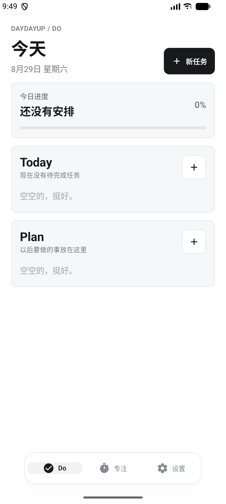
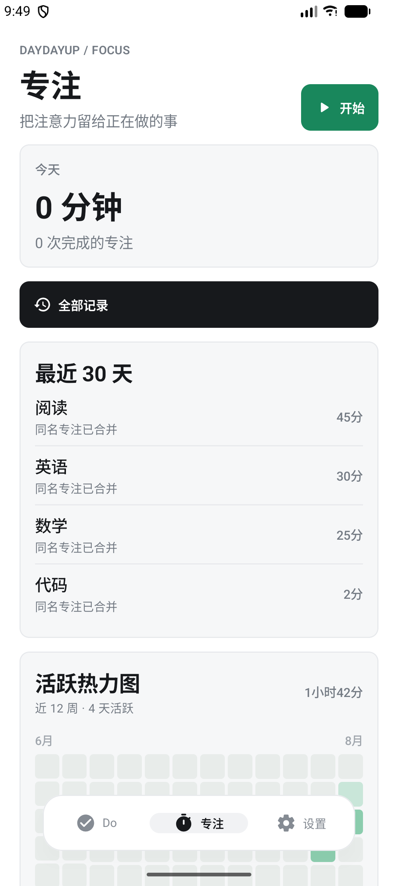
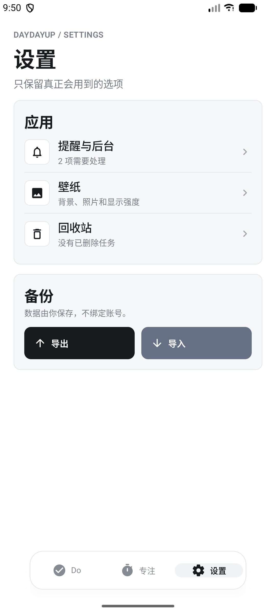
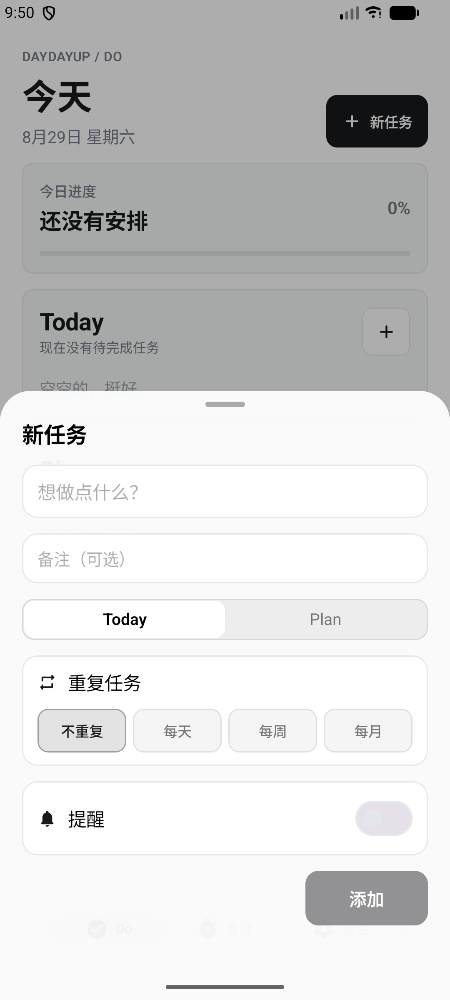
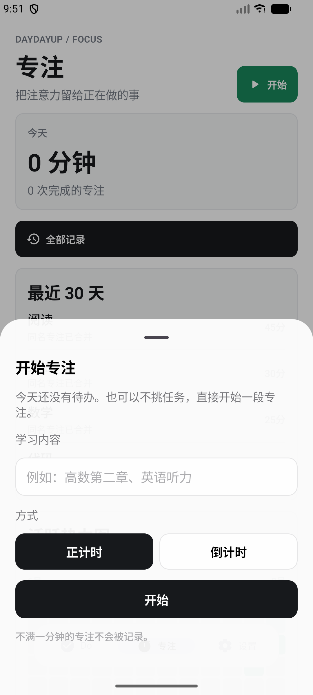
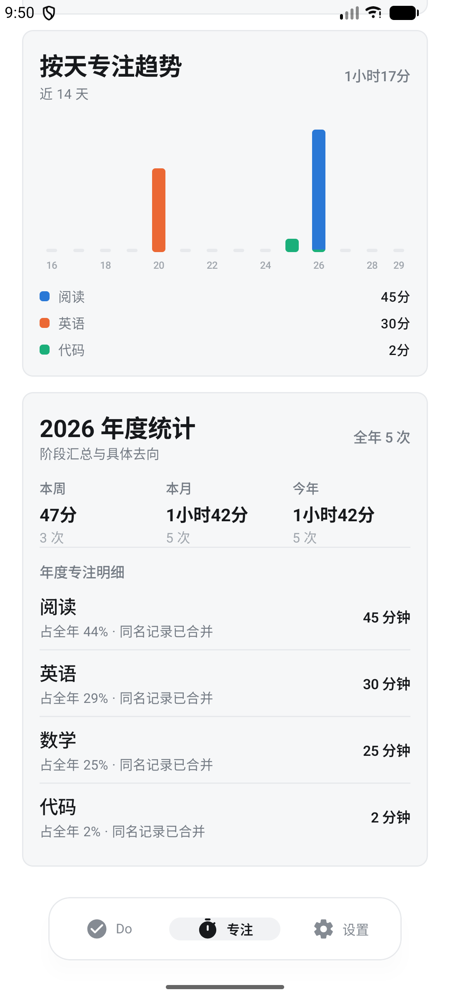
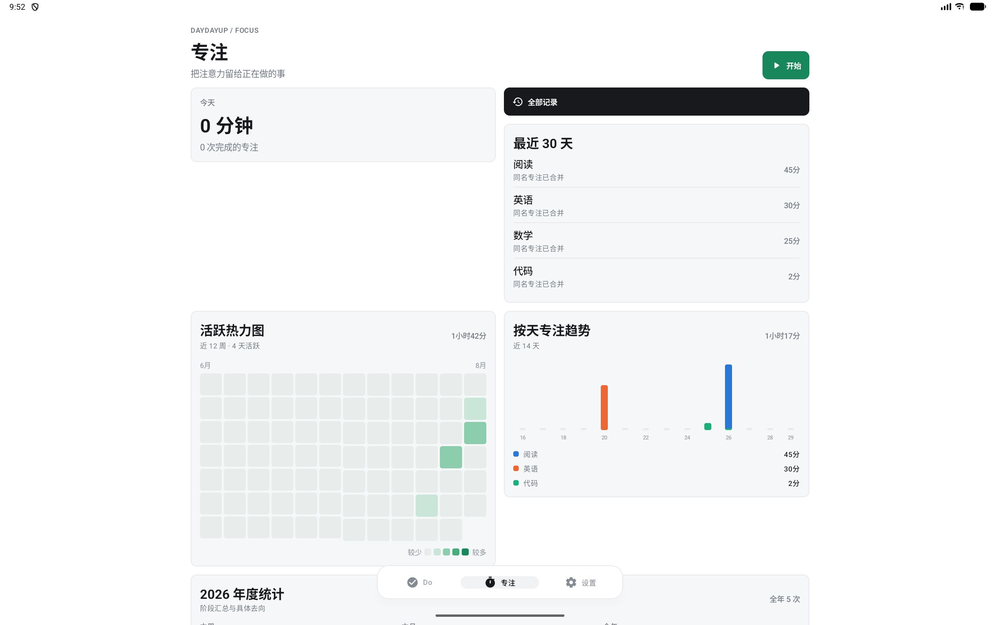

# DayDayUp

<p align="center">
  <strong>极简的 Android 任务与专注应用</strong><br />
  把今天要做的事、未来计划和真正投入的时间放在同一个地方。
</p>

<p align="center">
  Android 8.0+　·　手机 / 平板　·　Kotlin + Jetpack Compose
</p>

## 界面预览

<p align="center">
  
  
  
</p>

<p align="center">
  <sub>Today / Plan 任务管理　·　专注与统计　·　设置和数据备份</sub>
</p>

### 创建任务与开始专注

<p align="center">
  
  
</p>

### 专注统计

<p align="center">
  
  
</p>

同名专注会自动合并并累加时长。统计页提供近 12 周活跃热力图、近 14 天趋势，以及本周、本月和年度汇总；年度明细会逐项显示名称、时长和占比。

## 核心功能

| 模块 | 功能 |
| --- | --- |
| 任务管理 | Today 与 Plan、计划日期、备注、完成状态、回收站 |
| 重复任务 | 支持每天、每周、每月；完成后自动生成下一次任务 |
| 今日安排 | 任务拖拽排序，过期 Plan 自动进入 Today |
| 专注计时 | 从任务一键开始，支持正计时、倒计时、暂停与继续 |
| 数据统计 | 同名内容合并、每日趋势、活跃热力图、周/月/年度统计 |
| 提醒 | 任务定时通知、设备重启后恢复未完成提醒 |
| 数据管理 | JSON 导入与导出，导入时按记录 ID 合并 |

## 使用方式

1. 在 **Do** 中创建 Today 或 Plan 任务。
2. 为任务选择重复规则、计划日期或提醒时间。
3. 拖动 Today 任务右侧手柄调整当天顺序。
4. 点击任务右侧播放按钮，直接进入专注计时。
5. 在 **专注** 页面查看热力图、趋势和年度明细。

再次点击当前 Dock 入口可以返回白色启动界面。

## Android 平板适配

DayDayUp 会根据可用空间自动选择布局：

- 手机使用单列纵向布局。
- 平板竖屏增加内容宽度，但限制最大阅读宽度。
- 平板横屏切换为双栏统计与任务布局。
- Dock、状态栏、导航栏和底部安全区域会随方向自动调整。

## 技术栈

- Kotlin
- Jetpack Compose / Material 3
- Kotlin Coroutines / StateFlow
- Kotlinx Serialization
- Gradle Kotlin DSL

项目数据保存在本地 JSON 文件中，不依赖账号系统或远程服务。

## 本地构建

使用 Android Studio 打开仓库，等待 Gradle 同步完成后运行 `app` 配置。

Windows：

```powershell
.\gradlew.bat testDebugUnitTest assembleDebug
```

macOS / Linux：

```bash
./gradlew testDebugUnitTest assembleDebug
```

构建完成后的 Debug APK：

```text
app/build/outputs/apk/debug/app-debug.apk
```

## 项目结构

```text
app/src/main/java/com/doapp/
├─ data/       任务、专注记录与本地存储
├─ notify/     提醒、重启恢复与后台处理
└─ ui/         Compose 页面、组件与自适应布局

docs/screenshots/  README 使用的界面截图
```
